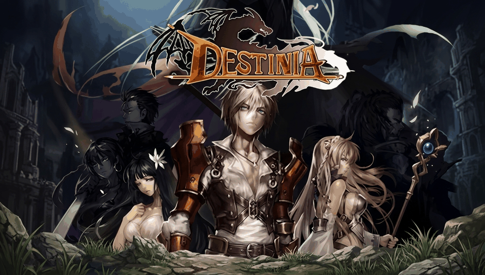

# DESTINIA — PS Vita Port

<p align="center">
  
</p>

<p align="center">
  <b>Native port of the classic action-RPG DESTINIA (데스티니아) by Gamevil / Morisoft for PlayStation Vita and PlayStation TV.</b>
</p>

<p align="center">
  
  
  
  
</p>

---

## 📖 Description

**DESTINIA** is an acclaimed 2D action-RPG originally released by Gamevil and Morisoft for mobile devices. This port runs the compiled C shared library (`libdestinia_jni.so`) from the Android version natively on the PlayStation Vita's ARM Cortex-A9 processor using a dynamic loader (*soloader*) and Android environment emulation (*FalsoJNI*).

### ✨ Port Features

- **Native ARMv7 CPU Execution**: Smooth 60 FPS performance without heavy emulation layers.
- **vitaGL Graphics Pipeline**: Renders the native 400x240 RGB565 framebuffer via a hardware-accelerated texture scaled to 960x544, preserving the 5:3 aspect ratio.
- **Full Physical Controls + Touch**: Full mapping of the console's physical buttons (D-Pad, Left Analog Stick, Action Buttons, L/R Triggers, Start, Select) alongside complete touchscreen support.
- **Dedicated Audio Engine**: Native multi-channel mixer with a dedicated thread (`SceAudioOut`), OGG Vorbis decoding (`libvorbisidec` / Tremor) for background music (BGM) and sound effects (SFX).
- **Save Management on ux0**: Seamless redirection of I/O calls to `ux0:data/destinia/saves/`.
- **Complete LiveArea**: Adapted icons and startup screens in indexed 8-bit PNG format (256 colors) under Title ID `DESTINIA1`.

---

## 🎮 Controls

| PS Vita Button | Action in Destinia |
| :--- | :--- |
| **D-Pad / Left Analog Stick** | Character Movement / Menu Navigation |
| **Cross ($\times$) / Circle ($\bigcirc$)** | Primary Attack / Interact / Confirm |
| **Square ($\square$)** | Active Skill 1 |
| **Triangle ($\triangle$)** | Active Skill 2 |
| **R Trigger (R1)** | Active Skill 3 |
| **L Trigger (L1)** | Quick Item Slot / Potion |
| **START** | In-Game Pause / Main Menu |
| **SELECT** | Minimap / Area Map |
| **Front Touchscreen** | Direct touch controls (menus, combat, inventory) |

---

## 📋 Prerequisites

To run the game on your PS Vita or PS TV, you will need:

1. A PS Vita / PS TV console running Custom Firmware (**HENkaku** or **Enso**) on firmware 3.60 or 3.65+.
2. [**kubridge.skprx**](https://github.com/TheOfficialFloW/kubridge/releases) (v0.8.1 or higher) installed in `ur0:tai/config.txt`.
3. [**libshacccg.suprx**](https://samilops2.gitbook.io/vita-troubleshooting-guide/shader-compiler/extract-libshacccg.suprx) installed in `ur0:data/` (can be extracted using the *ShaRKBR3ED* app).
4. A legitimate APK file of **DESTINIA v1.0.6** (Android EN/KR version, package `game.destiniaeng`).

---

## 📦 Installation Instructions

### Automated Method (Recommended)

1. Install the `destinia.vpk` file on your console using **VitaShell**.
2. On your PC, place the APK file (`destinia-1-0-6-en-kr-android.apk`) in the project root directory or extract it into `destinia_extract/`.
3. Run the asset preparation script:
   ```bash
   ./porting_tools/prepare_data_files.sh
   ```
4. Transfer the generated `ux0_data/destinia/` folder to `ux0:data/destinia/` on your PS Vita console via FTP or USB cable using VitaShell (or using `python3 porting_tools/manage_vita.py`).

### Final File Structure in `ux0:data/destinia/`

```text
ux0:data/destinia/
├── libdestinia_jni.so      <- Native library extracted from lib/armeabi/
├── assets/                 <- Game data files (.wmb, .agd, .wpn, .tdt, etc.)
├── sound/                  <- Music and sound effects in OGG format
├── saves/                  <- Saved games (created automatically)
└── logs/                   <- Debug logs
```

---

## 🛠️ Building from Source

The project uses the official **VitaSDK** toolchain (`softfp` mode) and CMake.

### Build Prerequisites

- **VitaSDK** configured in your environment (`$VITASDK` in `PATH`).
- VitaSDK libraries: `vitaGL`, `vitashark`, `mathneon`, `vorbisidec`, `pthread`.
- CMake (>= 3.14) and Make / Ninja.

### Build Steps

```bash
# 1. Create and enter the build directory
mkdir -p build && cd build

# 2. Configure the project with the PS Vita toolchain
cmake ..

# 3. Compile the ELF executable and package the VPK
make -j$(nproc)
```

This will generate `build/destinia.vpk` ready to transfer and install on your console.

---

## 🏗️ Project Structure

- `source/`: Source code for the native C/C++ loader (lifecycle, GL rendering, I/O, audio, input, JNI bindings).
- `lib/`: Auxiliary libraries (`falso_jni`, `so_util`, `libc_bridge`, `fios`, `sha1`, `kubridge`).
- `extras/`: LiveArea assets (`icon0.png`, `bg0.png`, `pic0.png`, `startup.png`, `template.xml`), `cpuinfo`, `meminfo`.
- `porting_tools/`: Automation tools, asset preparation (`prepare_data_files.sh`), and deployment scripts (`manage_vita.py`).

---

## ⚖️ Disclaimer

This repository contains **only** the open-source loader code and adaptation tools. **It does not contain any copyrighted game assets, data files, music, or proprietary DESTINIA binaries.** A legally acquired copy of the original Android game is required to play.

---

## 👥 Credits and Acknowledgements

- **Gamevil** & **Morisoft**: Original developers of DESTINIA.
- **TheFloW**: For `so_util`, `kubridge`, and foundational techniques for loading Android executables on PS Vita.
- **Rinnegatamante**: For `vitaGL` and continued support to the PS Vita porting scene.
- **v-atamanenko**: For `FalsoJNI` and the `soloader-boilerplate` base template.
- **Vita Community**: To all developers and enthusiasts in the PS Vita homebrew community.
